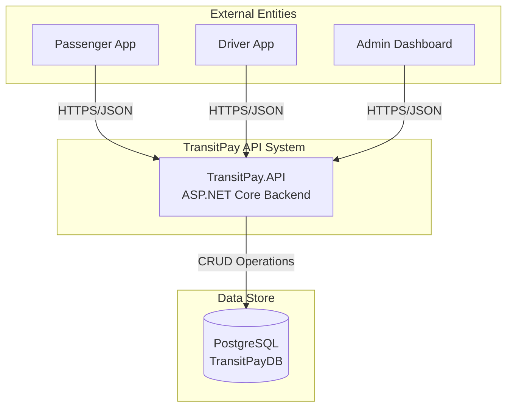
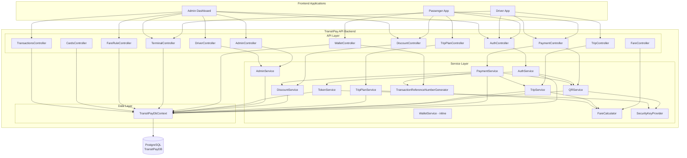
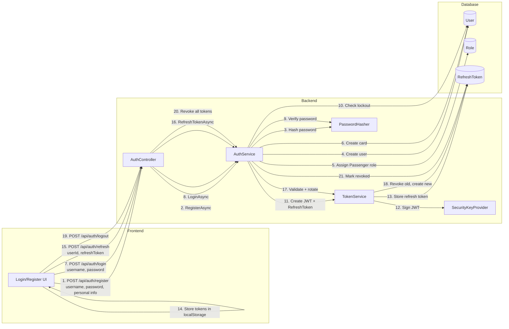
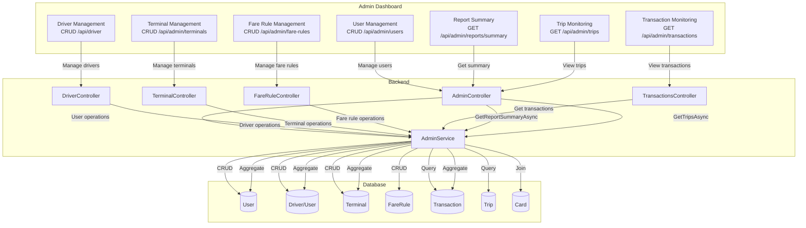

# TransitPay Prototype — Data Flow Diagrams (DFD)

**Generated:** 8/9/2026
**Scope:** Complete codebase analysis based on actual implementation

---

## Level 0 DFD — System Context



**Description:** Three frontend applications (Passenger, Driver, Admin) communicate with a single backend API via HTTPS/JSON. The backend persists all data in PostgreSQL.

---

## Level 1 DFD — Major Subsystems



**Description:** The backend is organized into three layers:
1. **API Layer** — 13 controllers exposing REST endpoints
2. **Service Layer** — 11 services containing business logic
3. **Data Layer** — Single DbContext for all database operations

---

## Detailed Payment Flow DFD (Conductor/Trip-Plan-Based)

This is the **canonical payment flow** for TransitPay.

```mermaid
graph TB
    subgraph "Passenger App"
        P1[1. Create Trip Plan<br/>POST /api/trip-plan]
        P2[2. Get QR Code<br/>GET /api/payment/qr/{cardId}]
        P3[3. Display QR<br/>Show to driver]
    end

    subgraph "Driver App"
        D1[4. Scan QR Code<br/>POST /api/payment/process-conductor]
        D2[7. View Trip Status<br/>GET /api/Trip/active]
        D3[8. End Trip<br/>POST /api/Trip/{tripId}/end]
    end

    subgraph "Backend Services"
        TPS[TripPlanService]
        QS[QRService]
        PS[PaymentService]
        TS[TripService]
        FC[FareCalculator]
        DS[DiscountService]
        TRN[TRN Generator]
    end

    subgraph "Database"
        TP[(TripPlan)]
        QR[(QRCode)]
        T[(Transaction)]
        W[(Wallet)]
        Card[(Card)]
        Trip[(Trip)]
        FR[(FareRule)]
        DT[(DiscountType)]
        DA[(DiscountApplication)]
        PD[(PassengerDiscount)]
        TC[(trn_counters)]
    end

    %% Flow
    P1 -->|"originTerminalId,<br/>destinationTerminalId"| TPS
    TPS -->|"Create"| TP
    TPS -->|"Calculate fare<br/>apply discount"| FC
    FC -->|"Lookup fare"| FR
    FC -->|"Check discount"| DS
    DS -->|"Query"| PD
    DS -->|"Query"| DA
    DS -->|"Query"| DT

    P2 -->|"Request QR"| QS
    QS -->|"Get/Create"| QR
    QS -->|"Read"| Card

    P3 -.->|"QR displayed"| D1

    D1 -->|"QRData, Signature,<br/>DriverId"| PS

    PS -->|"Validate QR"| QS
    PS -->|"Get active trip"| TS
    TS -->|"Query"| Trip

    PS -->|"Calculate fare"| FC
    FC -->|"Get fare by route"| FR
    FC -->|"Get passenger type"| Card

    PS -->|"Deduct fare"| W
    PS -->|"Generate TRN"| TRN
    TRN -->|"Atomic upsert"| TC

    PS -->|"Create transaction"| T
    PS -->|"Mark trip plan used"| TP
    PS -->|"Update trip revenue"| Trip

    D2 -->|"Check status"| TS
    D3 -->|"End trip"| TS
    TS -->|"Update"| Trip

    %% Styling
    classDef passenger fill:#e1f5ff,stroke:#01579b,stroke-width:2px
    classDef driver fill:#fff3e0,stroke:#e65100,stroke-width:2px
    classDef service fill:#f3e5f5,stroke:#4a148c,stroke-width:2px
    classDef database fill:#e8f5e9,stroke:#1b5e20,stroke-width:2px

    class PA,P1,P2,P3 passenger
    class DA,D1,D2,D3 driver
    class TPS,QS,PS,TS,FC,DS,TRN service
    class TP,QR,T,W,Card,Trip,FR,DT,DA,PD,TC database
```

### Payment Flow Steps (Detailed)

| Step | Actor | Action | API Endpoint | Service | Database |
|------|-------|--------|--------------|---------|----------|
| 1 | Passenger | Creates trip plan (origin → destination) | `POST /api/trip-plan` | TripPlanService | TripPlan, FareRule, Discount tables |
| 2 | Passenger | Requests QR code for card | `GET /api/payment/qr/{cardId}` | QRService | QRCode, Card |
| 3 | Passenger | Displays QR to driver | — | — | — |
| 4 | Driver | Scans QR, selects destination | `POST /api/payment/process-conductor` | PaymentService | — |
| 5 | Backend | Validates QR signature | — | QRService | QRCode |
| 6 | Backend | Retrieves active trip | — | TripService | Trip |
| 7 | Backend | Calculates fare (origin + destination + passenger type + discount) | — | FareCalculator | FareRule, Card, PassengerDiscount |
| 8 | Backend | Deducts fare from wallet | — | PaymentService | Wallet |
| 9 | Backend | Generates unique TRN | — | TRN Generator | trn_counters (atomic upsert) |
| 10 | Backend | Creates transaction record | — | PaymentService | Transaction |
| 11 | Backend | Marks trip plan as used | — | TripPlanService | TripPlan |
| 12 | Backend | Updates trip revenue | — | TripService | Trip |
| 13 | Driver | Views updated trip status | `GET /api/Trip/active` | TripService | Trip |
| 14 | Driver | Ends trip | `POST /api/Trip/{tripId}/end` | TripService | Trip |

---

## Authentication Flow DFD



---

## Trip Management Flow DFD

```mermaid
graph TB
    subgraph "Driver App"
        D1[Start Trip<br/>POST /api/Trip/start]
        D2[Update Boarding Origin<br/>PUT /api/Trip/{id}/boarding-origin]
        D3[End Trip<br/>POST /api/Trip/{id}/end]
        D4[View History<br/>GET /api/Trip/history]
    end

    subgraph "Backend"
        TC[TripController]
        TS[TripService]
        FC[FareCalculator]
    end

    subgraph "Database"
        Trip[(Trip)]
        T[(Transaction)]
        Term[(Terminal)]
    end

    D1 -->|"DriverId, OriginTerminalId,<br/>FinalDestinationTerminalId"| TC
    TC -->|"StartTripAsync"| TS
    TS -->|"Create trip"| Trip
    TS -->|"Validate terminals"| Term

    D2 -->|"TripId, OriginTerminalId"| TC
    TC -->|"UpdateCurrentBoardingOriginAsync"| TS
    TS -->|"Update trip"| Trip

    D3 -->|"TripId"| TC
    TC -->|"EndTripAsync"| TS
    TS -->|"Update trip status"| Trip
    TS -->|"Calculate final fare"| FC
    FC -->|"Get fare"| Term
    TS -->|"Create transaction"| T

    D4 -->|"page, pageSize"| TC
    TC -->|"GetTripHistoryAsync"| TS
    TS -->|"Query"| Trip
```

---

## Discount Flow DFD

```mermaid
graph TB
    subgraph "Passenger App"
        P1[View Discount Types<br/>GET /api/Discount/types]
        P2[Apply for Discount<br/>POST /api/Discount/apply]
        P3[View My Applications<br/>GET /api/Discount/applications/card/{id}]
    end

    subgraph "Admin Dashboard"
        A1[View Pending Applications<br/>GET /api/discount/applications/pending]
        A2[Approve Application<br/>POST /api/discount/applications/{id}/approve]
        A3[Reject Application<br/>POST /api/discount/applications/{id}/reject]
        A4[Manage Discount Types<br/>CRUD /api/discount/types]
    end

    subgraph "Backend"
        DC[DiscountController]
        DS[DiscountService]
    end

    subgraph "Database"
        DT[(DiscountType)]
        DA[(DiscountApplication)]
        PD[(PassengerDiscount)]
        Card[(Card)]
    end

    P1 -->|"List active types"| DC
    DC -->|"GetDiscountTypesAsync"| DS
    DS -->|"Query"| DT

    P2 -->|"CardId, DiscountTypeId,<br/>Document"| DC
    DC -->|"ApplyForDiscountAsync"| DS
    DS -->|"Create application"| DA
    DS -->|"Validate card"| Card

    P3 -->|"CardId"| DC
    DC -->|"GetApplicationsByCardAsync"| DS
    DS -->|"Query"| DA

    A1 -->|"List pending"| DC
    DC -->|"GetPendingApplicationsAsync"| DS
    DS -->|"Query WHERE status=Pending"| DA

    A2 -->|"ApplicationId"| DC
    DC -->|"ApproveApplicationAsync"| DS
    DS -->|"Update status=Approved"| DA
    DS -->|"Create/update"| PD

    A3 -->|"ApplicationId, Reason"| DC
    DC -->|"RejectApplicationAsync"| DS
    DS -->|"Update status=Rejected"| DA

    A4 -->|"CRUD operations"| DC
    DC -->|"Manage types"| DS
    DS -->|"CRUD"| DT
```

---

## Admin Operations Flow DFD



---

## Identified Inconsistencies and Issues

### 1. Frontend/Backend Contract Mismatches

| Issue | Frontend | Backend | Severity | Status |
|--------|----------|---------|----------|--------|
| **Station vs Terminal naming** | Passenger app uses `stationId` in `Transaction` interface | Backend uses `terminalId` | Medium | ⚠️ Partially fixed (admin/driver fixed, passenger app still has `stationId` field) |
| **Transaction interface redundancy** | Admin dashboard has both `transactionReferenceNumber` and `referenceNumber` | Backend only has `TransactionReferenceNumber` | Low | ⚠️ `referenceNumber` is unused in frontend |
| **Discount status mapping** | Frontend maps `status === 'Approved' ? 'Active' : 'Inactive'` | Backend returns `Approved`, `Pending`, `Rejected`, `Expired` | Low | ⚠️ Frontend incorrectly maps non-Approved to `Inactive` |

### 2. Dead Paths

| Dead Path | Location | Description |
|-----------|----------|-------------|
| **PaymentSessionService** | Backend | Removed in P1 — all 7 files deleted |
| **TripModal.tsx** | Admin Dashboard | Deleted in P2 — 0 imports found |
| **StationModal.tsx** | Admin Dashboard | Deleted in P2 — renamed to TerminalModal |
| **`/api/auth/validate`** | Backend | Endpoint exists but **not called** by any frontend app |

### 3. Missing Flows

| Missing Flow | Impact | Recommendation |
|--------------|--------|----------------|
| **No passenger-initiated payment** | Passengers cannot pay without a driver scanning QR | Future enhancement — add `POST /api/payment/self-scan` or similar |
| **No refund flow** | Cannot reverse transactions | Future enhancement — add `POST /api/transactions/{id}/refund` |
| **No E2E integration tests** | No automated verification of full flows | P2-10 — add integration tests |
| **No WebSocket/real-time updates** | Drivers must poll for trip updates | Future enhancement — add SignalR for real-time trip status |

### 4. Security Observations

| Observation | Risk | Mitigation |
|-------------|------|------------|
| **JWT stored in localStorage** | XSS vulnerability | Consider httpOnly cookies for refresh tokens |
| **No rate limiting on discount applications** | Potential abuse | Add rate limiting to `POST /api/discount/apply` |
| **Admin can top-up any wallet** | No audit trail for top-ups | TRN is generated, but consider separate admin audit log |
| **QR code contains card number** | Card number exposure if QR is intercepted | QR is signed, but consider using token-based QR instead |

### 5. Data Consistency Issues

| Issue | Description | Impact |
|--------|-------------|--------|
| **TripPlan.FinalFarePrice** | Calculated at creation time, may become stale if discount changes | Low — discount is locked at plan creation |
| **Wallet balance** | Updated directly without optimistic concurrency | Medium — concurrent top-ups could cause lost updates |
| **TransactionReferenceNumber** | Now atomic with counter table (fixed in current session) | ✅ Fixed |

---

## Summary Statistics

| Metric | Count |
|--------|-------|
| **Frontend Applications** | 3 (Passenger, Driver, Admin) |
| **Backend Controllers** | 13 |
| **Backend Services** | 11 |
| **Database Tables** | 18+ (including history tables) |
| **API Endpoints** | 50+ |
| **Major Data Flows** | 6 (Auth, Payment, Trip, Discount, Wallet, Admin) |
| **Identified Issues** | 9 (3 mismatches, 3 dead paths, 2 missing flows, 1 security) |
| **Critical Issues** | 0 |
| **Medium Issues** | 2 |
| **Low Issues** | 7 |

---

## Recommendations

1. **Fix passenger app `stationId` field** — Update `Transaction` interface in `passenger-app/src/lib/wallet.ts` to use `terminalId` instead of `stationId`
2. **Add refund flow** — Implement `POST /api/transactions/{id}/refund` with admin authorization
3. **Add integration tests** — P2-10 item, cover the 6 major flows
4. **Consider WebSocket** — Add SignalR for real-time trip updates to driver app
5. **Clean up frontend** — Remove unused `referenceNumber` field from admin dashboard `Transaction` interface
6. **Fix discount status mapping** — Update `getActivePassengerDiscounts` to correctly map status values

---

## Notes

- All diagrams are based on **actual code analysis** — no assumed functionality
- The payment flow uses the **canonical conductor/trip-plan-based** flow (session-based flow was removed in P1)
- Enum serialization uses **string values** via `JsonStringEnumConverter`
- All IDs are **integers** (Guid/int mismatch resolved in P1)
- TRN generation uses **atomic counter table** for uniqueness (fixed in current session)